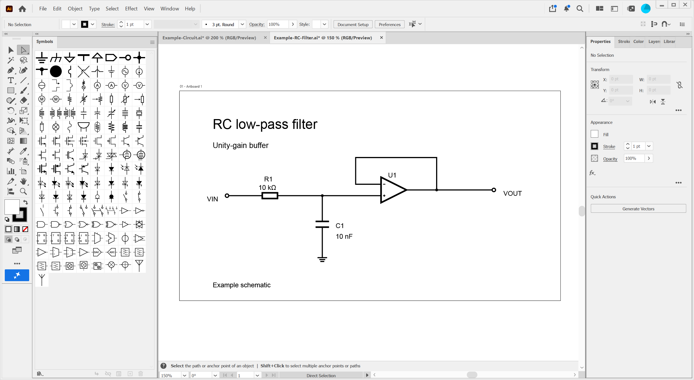

# illustrator-circuit-symbols

  

A symbol library for drawing schematics and block diagrams with Adobe Illustrator.

Other versions: [Affinity Designer](https://github.com/keikawa/affinity-circuit-symbols-asset) · [Inkscape](https://github.com/keikawa/InkscapeCircuitSymbols)

## Screen shot

## Usage and Recommended Settings

1. [Download](https://github.com/keikawa/illustrator-circuit-symbols/raw/main/Schematic-Symbols.ai) and import Schematic-Symbols.ai. Open **Window > Symbols**, then choose **Symbol Libraries Menu > Other Library…** and select the downloaded file. How to import symbol libraries is described on [this page](https://helpx.adobe.com/illustrator/desktop/manage-objects/traces-mockups-symbols/create-or-import-symbol-libraries.html).

2. Drag a symbol from the library panel onto the artboard. Enable **View > Show Grid** and **View > Snap to Grid**.

3. In **Edit > Preferences > Guides & Grid** (Windows), set **Gridline every** to **5 px** and **Subdivisions** to **5**. On macOS, open **Guides & Grid** from Illustrator's preferences/settings menu.

Tips: The schematic symbols are designed with a 1-pt line width. To draw the wiring, use the **Pen Tool (P)** with **Fill: None** and a **1-pt Stroke**. To edit a placed symbol independently, select it and choose **Break Link to Symbol** in the Symbols panel.

[日本語ガイド](README-ja.md)

## Licence

[MIT Licence](LICENSE)

